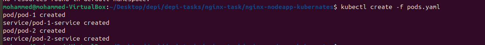
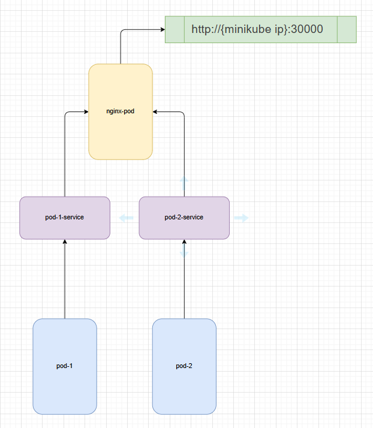

# Nginx load balancing - reverse proxy project

## Summery

This was a **DEPI** project where the task was as follows

* Create 3 pods
* First one to setup nginx
* Second one to run nodeapp
* Third one another nodeapp

### Steps to create the project

1. Dockerize the two node apps
2. push them to your dockerhub
3. create two pods with the two app and expose them with service
4. in nginx create load balancing to distribute the traffic between two pods and acts as a reverse proxy

## How to use it

1. `git clone https://github.com/MoAdel10/revers-proxy_load-balancing-nginx.git`
2. `kubectl create -f pods.yaml`
3. `kubectl create -f nginx-pod.yaml`
4. in comand line type after getting minikube ip `curl http:<minikube ip>:30000/` or in any browser

### to remove it

1. `kubectl delete -f nginx-pod.yaml`
2. `kubectl delete -f pod.yaml`

## How i solved this task

1. created a simple node express app  [repo link](https://github.com/MoAdel10/simple-node-app.git )
2. create a docker image and uploaded it to docker hub [ mohamedadel582/nodeapp ]
3. created pods.yaml to create the nodeapp pods and services [ cluster ip type service ]
4. created nginx-pod.yaml  to create the nginx pod and it's service and it's ConfigMap to edit nginx configuration and set it up as a load balancer and a reverse proxy [ NodePort type service ]
5. got the ip of minikube 
6. the result looked like this  [ pod-1 ]                       and after clicking one more time due to load balancing it shows the other pod app [ pod-2 ]  

## The basic design of the project

